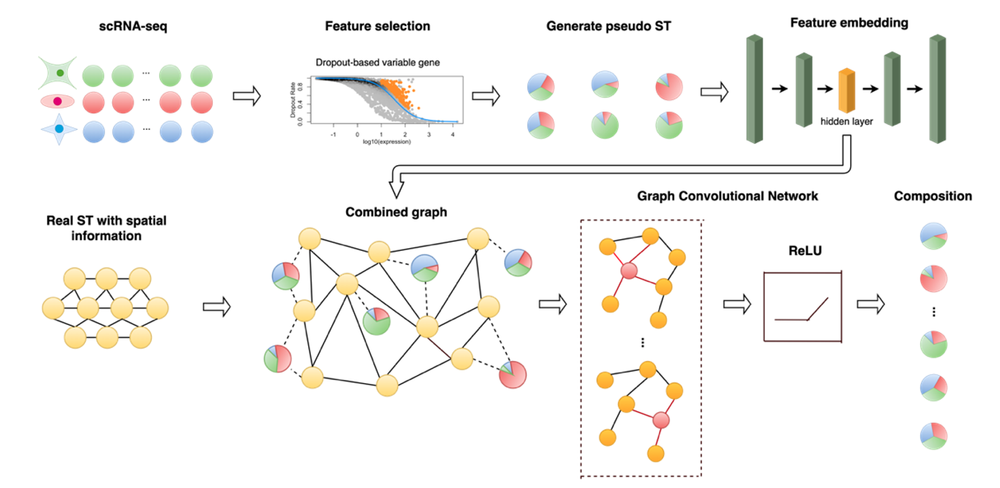

# SD<sup>2</sup>: Spatially resolved transcriptomics deconvolution through integration of spatial and dropout information
<br>


 
## Training process 

<br>

Extract the dropout genes and generate pseudo-ST spots
The input files are following:
1. sc_matrix (The expression profile of scRNA-seq data whose rows are genes and columns are cells)
2. st_matrix (The expression profile of ST data whose rows are genes and columns are spots)
3. cell_type (The cell-type annotation vector of scRNA-seq data whose value is cell-type name corresponding with each cell)
4. st_location (The data frame of coordinates for ST spots whose rows are spots indices and columns are "X" and "Y" representing the X and Y coordinates of each spot)

```
source(SD2_utiles.R)

SD2(sc_matrix,
    st_matrix,
    cell_type,
    ST_location = st_location,
    spot_num = 300, 
    lower_cellnum = 10,
    upper_cellnum = 20)
```
The first four items of process_data function are required.
'spot_num' is the number of generated pseudo-ST spots.
‘lower_cellnum' and 'upper_cellnum' indicate the range of cell number of each spot you want.


Construct the graph according to the transcriptional similarity and spatial connection and train by GCN

```
system(python train.py)
```

The final result would appear in the folder 'SD2_results' and entitled as "predict_output.csv'.

Here is an example of apply SD<sup>2</sup> to the PDAC datasets (generated from Spatial Transcriptomics technique)


```
### load the SD<sup>2</sup> utiles and the orginal PDAC data with its adjacent scRNA-seq data

source(SD2_utiles.R)
ST_data = readRDS('PDAC_GSM4100721.rds')
sc_count = ST_data$sc_count
st_count = ST_data$st_count
cell_type = ST_data$cell_type
st_location = ST_data$st_location

### apply the SD<sup>2</sup> to PDAC

SD2(as.matrix(sc_count),
    as.matrix(st_count),
    cell_type,
    ST_location = st_location[,c('x','y')],
    spot_num = 300, 
    lower_cellnum = 10,
    upper_cellnum = 20)

system(python train.py)

```


