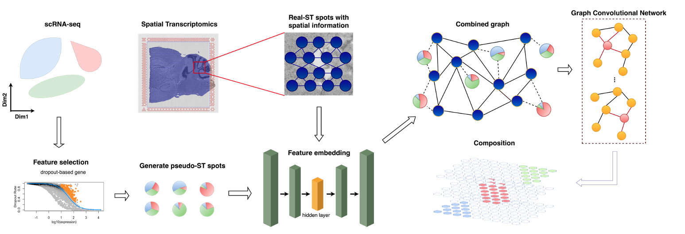

# SD<sup>2</sup>: Spatially resolved transcriptomics decon-volution through integration of spatial and dropout information

 
## Training process 

<br>

Extract the dropout genes and generate pseudo-ST spots

```
Rscript SD2.R
```

Construct the graph according to the transcriptional similarity and spatial connection and train by GCN

```
python train.py
```
